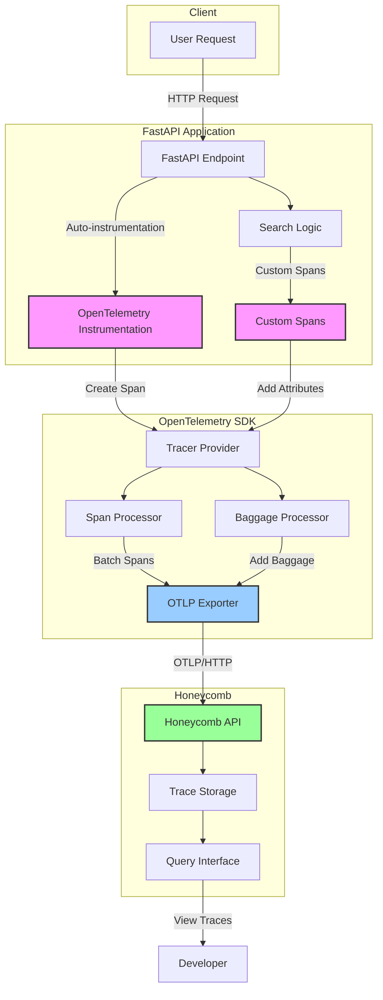
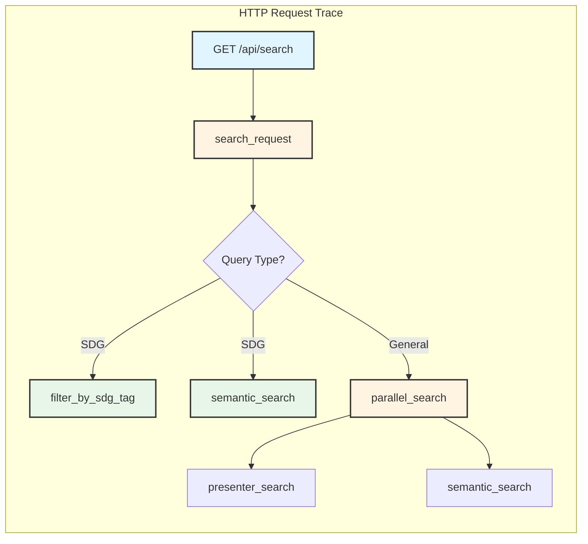
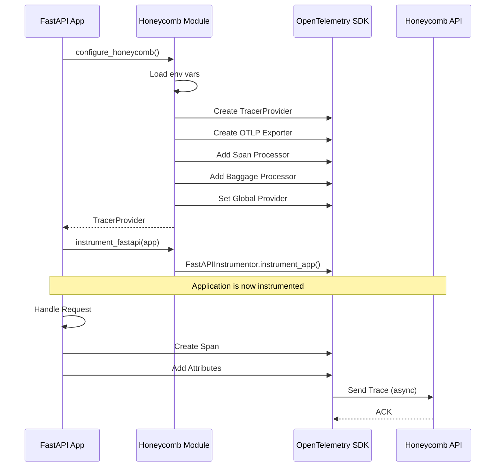
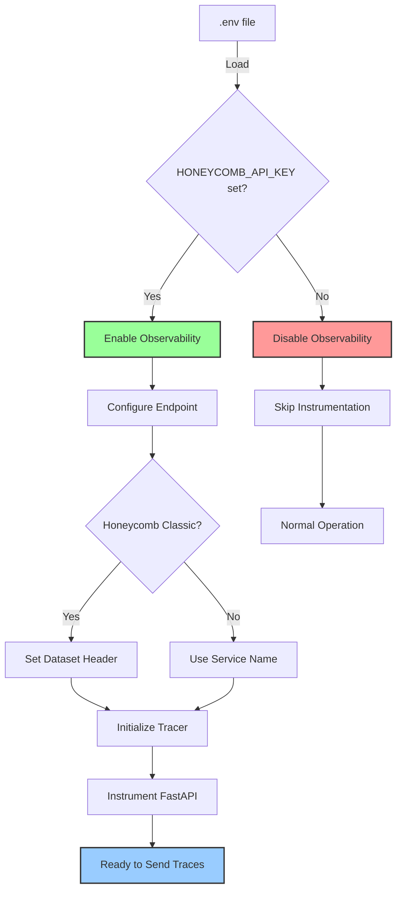

# Honeycomb Observability Architecture

## Data Flow Diagram



## Trace Structure



## Span Attributes

### Root Span (HTTP Request)
```
http.method: GET
http.route: /api/search
http.status_code: 200
http.url: /api/search?query=sdg7
```

### search_request Span
```
query: "sdg7"
request_id: "abc-123-def-456"
client_ip: "192.168.1.1"
query.normalized: "sdg7"
query.is_sdg: true
query.sdg_number: 7
search.type: "sdg_tag"
search.sdg_tag: "sdg7"
query.augmented: "sdg7 clean energy renewable..."
results.final_count: 10
search.duration_seconds: 0.1234
```

### filter_by_sdg_tag Span
```
sdg_results.count: 25
```

### semantic_search Span
```
semantic_results.count: 15
```

## Configuration Flow



## Environment Configuration



## Key Components

### 1. Tracer Provider
- Central component managing trace creation
- Configured with service name and resource attributes
- Manages span processors

### 2. OTLP Exporter
- Exports traces to Honeycomb via HTTP
- Uses OTLP (OpenTelemetry Protocol)
- Includes Honeycomb API key in headers

### 3. Span Processor
- Batches spans for efficient export
- Handles async sending to reduce latency
- Configurable batch size and timeout

### 4. Baggage Processor
- Propagates baggage as span attributes
- Useful for cross-cutting concerns
- Automatically adds to all child spans

### 5. FastAPI Instrumentor
- Automatically instruments all endpoints
- Captures HTTP metadata
- Creates parent spans for requests

## Data Types Tracked

### Traces
- Request flow through the application
- Parent-child span relationships
- Timing information

### Spans
- Individual operations within a trace
- Start and end times
- Status (OK, ERROR)

### Attributes
- Key-value pairs attached to spans
- Query parameters
- Result counts
- Performance metrics
- Error information

### Events
- Point-in-time occurrences
- Errors and exceptions
- Log messages (if enabled)

## Best Practices

1. **Use Descriptive Span Names**: Name spans after the operation, not the function
2. **Add Relevant Attributes**: Include context that helps debugging
3. **Create Spans for Expensive Operations**: Track database queries, API calls, etc.
4. **Don't Over-Instrument**: Too many spans can add overhead
5. **Use Baggage Sparingly**: Only for truly cross-cutting data
6. **Never Log Sensitive Data**: No passwords, API keys, PII in attributes
7. **Sample in Production**: Use sampling to control data volume
8. **Monitor Exporter Health**: Check for export failures

## Performance Impact

- **Minimal Overhead**: ~1-2ms per request
- **Async Export**: Doesn't block request handling
- **Batching**: Reduces network calls
- **Sampling**: Can reduce overhead further

## Security Considerations

- API key stored in environment variable (not in code)
- `.env` file in `.gitignore`
- No sensitive data in span attributes
- HTTPS for all communication with Honeycomb
- Baggage not used for sensitive data (sent in headers)
